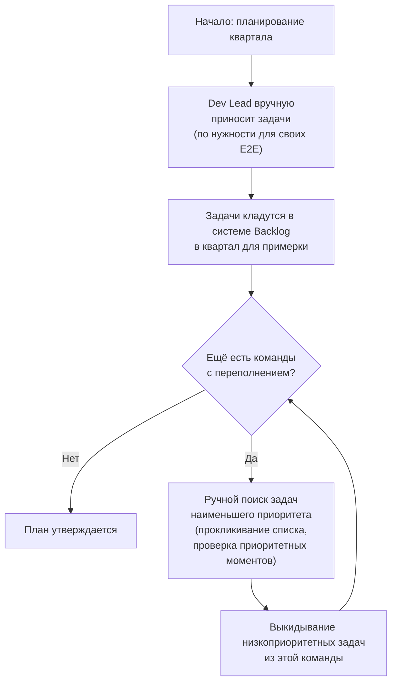
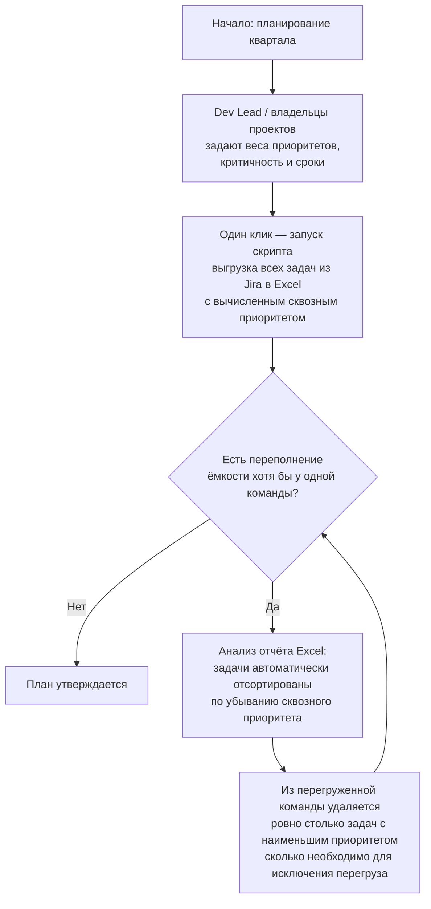

# Task Extractor — автоматическая обработка и приоритизация задач

## Проблема

Тимлиды и руководители тратили 30–50 человеко-дней в месяц на участие в планировании. Допускались ошибки из-за отсутствия видения полной картины. 

## Решение

Написан скрипт на Python (pandas, openpyxl) выгружает задачи в плоский список, все заинтересованные лица видят единую плоскую таблицу.

## Операционные выгоды

| Задача / проблема | Как решалось ДО | Как решается ПОСЛЕ | Полученные выгоды (человеко-дней в месяц на проект 350 чел / 30 команд) |
|------------------|----------------|---------------------|---------------------------------------------------------------------------|
| **Трудозатраты на ручную обработку** | 10–20 чд/месяц (сборка, копирование, приоритизация) | 2–3 чд/месяц – только на анализ, остальное автоматизировано | экономия ~ 8-15 чд/мес со встреч |
| **Ошибки приоритизации и человеческий фактор** | Высокие: пропущена важная задача, ошибка приоритета. Приводит к большому количеству корректировок в течение квартала | Низкие: алгоритм уменьшает количество корректировок кратно | Снижение кол-ва ошибок на 60-70% (около 30-40 ошибок в квартал) -> 10 чд / за месяц  |
| **Корректировка во время квартала (поиск «донора»)** | ~8 чд/месяц  – нужно узнать актуальность приоритетов каждой задачи вручную | 5 минут – РП видит готовые варианты (отсортированный список низкоприоритетных задач) и принимает решение | ~1 чд/мес |
| **Поиск ошибок приоритетов** | Сложно, не видно полной картины по всем задачам и заказчикам | Легко: сортировка по приоритету сразу показывает «артефакты» человеку в контексте | **~5 чд/мес** (экономия времени менеджеров на ручной перепроверке) |

Перечисленная экономия времени позволила выделить сотрудника в помощь в один из проектов без ухудшения качества планирования. 

### Стратегические выгоды (выходят за рамки экономии часов)

- Рост доверия стейкхолдеров к процессу планирования
- Увеличение доли корректно завершённых проектов (снижение срывов из-за необоснованного вырезания задач)
- Прозрачность → заказчик быстрее утверждает план и реже его меняет
- Возможность объективно аргументировать, почему задача не попала в план (снижение эскалаций на уровень выше)

## Диаграммы процесса
 |
### AS-IS (как было)

### TO-BE (как стало)

## Сложности реализации 

проблема: Иерархическая структура задач, оценок и фич в jira, нельзя получить оценку простым запросом 
Решение: JQL запрос в structure Jira собирает необходимые данные, формируется excel файл и уже он поступает на вход скрипту. 

Проблема: отказ релизного комитета пользоваться скриптом (недоверие к младшему специалисту) 
Решение: Применял его на встречах, указывая на конкретных кандидатов к исключению. (Позже сами заинтересовались скриптом)

## Proof of Work

### Статус внедрения
- Скрипт находится в промышленной эксплуатации **3+ месяца**
- Используется при квартальном планировании и промежуточных корректировках

### Обратная связь от РП проекта

> "Кроме огромной экономии времени(раньше планирование реально становилось основной задачи недели) кратно повысилось качество самого планирования, ошибок стало гораздо меньше"   
> — Руководитель проекта

> "При поиске донора приходилось долго ждать, пока прогрузятся все системы, откроются все кандидаты, теперь всё это в плоском списке, картина стала понятнее" 
> — Team Lead одной из команд

### Где используется
- Квартальное планирование (PMO)
- Еженедельные корректировки загрузки команд
